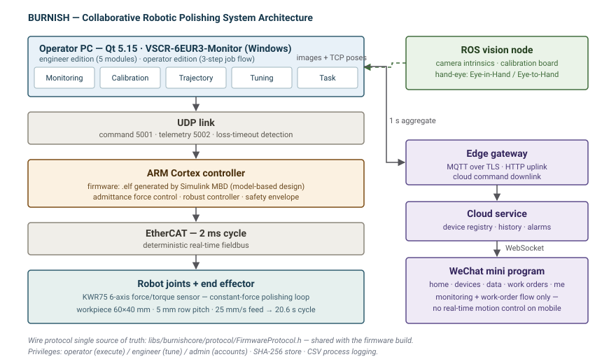

# BURNISH (灵犀智磨) — Collaborative Robotic Polishing Software Suite

[](https://opensource.org/licenses/MIT)
[](https://lingxi-polish.netlify.app/)
[](https://www.qt.io/)

A complete host-computer software suite for a **collaborative robotic polishing cell**: constant-force
grinding/polishing with a 6-axis force/torque sensor, EtherCAT real-time control, hand-eye vision
calibration, trajectory generation, process database, and a WeChat mini-program for remote monitoring.

Built for the **iCAN College Student Innovation & Entrepreneurship Competition**. Team: **Hefei
University of Technology (合肥工业大学)**.

> **Try it without installing anything:** the interactive demo runs entirely in your browser —
> [https://lingxi-polish.netlify.app/](https://lingxi-polish.netlify.app/)

---

## 1. Highlights

| Area | What is implemented |
|---|---|
| **Real-time telemetry** | 2 ms control loop; UDP telemetry (cmd `5001` / telemetry `5002`) with packet-loss timeout detection |
| **Constant-force control** | Admittance-style force control with a switchable robust controller; A/B dual-channel simulation shares one disturbance/noise sequence |
| **6-axis F/T gravity compensation** | Least-squares `f = m·u + b`, solved by 4×4 Gaussian elimination with partial pivoting |
| **Hand-eye calibration** | Eye-in-Hand / Eye-to-Hand, camera intrinsics derived from focal length & sensor size, sub-pixel reprojection |
| **Trajectory generation** | Point cloud → scan-line (zig-zag / spiral) path with feed-rate aware cycle-time estimate |
| **Process database** | SQLite-backed reusable process recipes, with CSV export |
| **Access control** | Three privilege levels (operator / engineer / admin), SHA-256 account store |
| **Cloud & mobile** | Edge gateway (MQTT over TLS, HTTP) → cloud → WebSocket → mini program (view + work orders) |

---

## 2. System architecture



The five layers, top to bottom:

1. **Operator PC (Qt 5.15, Windows)** — `VSCR-6EUR3-Monitor`, in an engineer edition (5 modules) and a
   simplified operator edition.
2. **UDP link** — command down / telemetry up, driven by one shared protocol header.
3. **ARM Cortex controller** — runs an `.elf` generated by **Simulink MBD** (model-based design).
4. **EtherCAT, 2 ms cycle** — joint drivers and the **KWR75 6-axis force/torque sensor**.
5. **Robot + end effector** — the physical polishing cell.

Side branches: a **ROS vision** node supplies camera intrinsics and TCP poses for hand-eye calibration,
and an **edge gateway** mirrors telemetry to the cloud for the mini program.

---

## 3. Measured results

All figures below come from the project's own verification harness
(`demo/_verify.py`, `demo/_smoke.js`), not from hand-written claims.

**Robust force control (A/B over 60 s, identical disturbance & noise sequence)**

| Metric | Baseline | Robust controller | Improvement |
|---|---|---|---|
| RMS force error | 2.25 N | 0.62 N | **72.2 %** |
| MAE / peak deviation / steady-state RMS / overshoot | — | — | 68 – 72 % |
| Steady-state accuracy vs. 20 N target | — | — | ≈ 3 % |

**6-axis F/T gravity compensation (6 independent trials)**

| Item | Result |
|---|---|
| Payload mass error | mean −0.001 kg, σ 0.002 kg |
| Per-axis zero bias | mean < 0.011 N |
| Residual | mean 0.059 N ≈ injected noise σ = 0.06 N (i.e. at the noise floor) |

**Hand-eye calibration**

| Item | Result |
|---|---|
| Reprojection RMS | **0.271 px** (sub-pixel) |
| Observability metric | Pose coverage = cube root of the normalized RPY bounding-box volume |

**Trajectory sanity check** — 60 × 40 mm workpiece, 5 mm row spacing, 25 mm/s feed → 515 mm path →
**20.6 s** cycle time.

---

## 4. Repository layout

```
LingxiPolish/
├── LingxiPolish.pro              # top-level qmake subdirs project
├── common.pri                    # C++17, encoding, version, output dirs, core-lib link
├── libs/burnishcore/             # shared core library (static)
│   ├── protocol/                 #   FirmwareProtocol.h — single source of truth, shared with firmware
│   ├── model/                    #   F/T, joint, process config, alarm models
│   ├── comm/                     #   UDP controller client + telemetry simulator
│   └── util/                     #   CSV logging, 3-level permissions (SHA-256)
├── apps/
│   ├── monitor-engineer/         # engineer host app — 5 modules, one .pri each
│   │   └── modules/{monitoring, calibration, trajectory, tuning, task}
│   └── monitor-operator/         # operator app — pick recipe → load → polish → record
├── tools/
│   ├── trajectory-planner/       # point cloud → scan-line trajectory
│   ├── data-analyzer/            # force-tracking metrics + A/B comparison
│   └── process-db/               # SQLite process library
├── cloud/edge-gateway/           # MQTT/HTTP uplink + cloud command downlink
├── demo/                         # zero-dependency interactive HTML demo + test harness
└── docs/                         # Chinese design docs, program intro, development log
```

---

## 5. Build

Requires **Qt 5.15.2 (MinGW 8.1, Windows x64)** with **Qt Charts**. The code is Qt 6.x compatible
(QtCharts namespace differences are isolated behind `QT_VERSION` macros).

```bash
qmake LingxiPolish.pro
make          # on Windows with MSVC toolchain, use: jom
```

Outputs land in `build/<debug|release>/bin`. Verified to build clean with 7 targets under
Qt 5.15.2 MinGW.

**Optional dependencies** (each behind an `LX_HAVE_*` macro, so the project still builds without them):

| Dependency | Enables |
|---|---|
| OpenCASCADE | STEP surface import in the trajectory planner |
| OpenCV | Real camera/hand-eye calibration solving |
| QtMqtt | MQTT uplink in the edge gateway (degrades gracefully) |

---

## 6. Interactive demo

`demo/monitor-demo.html` is a **single self-contained file (~214 KB), zero external dependencies**.
It reproduces the host UI and the control logic in the browser:

- 8 views: monitoring · force tuning · trajectory · data analysis · process library · hand-eye
  calibration · system architecture · mini-program preview
- Live 2 ms-stepped telemetry simulation; the admittance parameters genuinely shape the response
- A/B dual-channel comparison under one shared disturbance sequence
- Communication-loss simulation, automatic piece counting, alarm feed
- Runs the real algorithms (gravity-compensation least squares, hand-eye solve)

```bash
# local preview
cd demo && python -m http.server 8000
# then open http://127.0.0.1:8000/monitor-demo.html
```

**Verification harness** (kept in the repo so results are reproducible):

```bash
python demo/_verify.py     # static contracts: 246 DOM ids vs. JS references, view/nav consistency
node   demo/_smoke.js      # boots the real page JS under a minimal DOM/Canvas stub, checks numerics
python demo/_vmini.py      # mini-program DOM structure & div-nesting contracts
```

---

## 7. Documentation

| Document | Contents |
|---|---|
| [`docs/README.md`](docs/README.md) | Full Chinese documentation — architecture, modules, algorithms, build, test baselines |
| [`docs/program-intro.html`](docs/program-intro.html) | Program introduction (competition submission) |
| [`docs/dev-log.html`](docs/dev-log.html) | Development log following the iCAN template |
| [`docs/VERCEL_DEPLOY.md`](demo/VERCEL_DEPLOY.md) | Deployment notes |

---

## 8. Scope & non-goals

- The **mini program** in `demo/` is a UI/interaction preview rendered inside the HTML demo; the
  production WeChat mini program is a separate, non-Qt deliverable.
- The **cloud SaaS backend** is out of scope for this repository; the edge gateway defines the
  protocol boundary only.
- Firmware is generated by Simulink MBD and is not part of this repo — but the wire protocol
  (`libs/burnishcore/protocol/FirmwareProtocol.h`) is the shared single source of truth.

---

## 9. License

Released under the [MIT License](LICENSE).

---

## 中文说明

灵犀智磨（BURNISH）协作打磨机器人配套软件体系。上位机基于 **Qt 5.15**（`VSCR-6EUR3-Monitor`），
通过 **UDP** 与 **ARM Cortex 控制器**（Simulink MBD 生成 `.elf`）通信，控制器以 **EtherCAT 2 ms**
周期驱动关节与 **KWR75 六维力传感器**；视觉部分通过 **ROS** 接入。

- 在线演示：<https://lingxi-polish.netlify.app/>
- 完整中文文档：[`docs/README.md`](docs/README.md)（含模块划分、核心算法、构建方式、测试基线）
- 参赛队伍：**合肥工业大学 iCAN 战队**
- 开源协议：[MIT](LICENSE)
