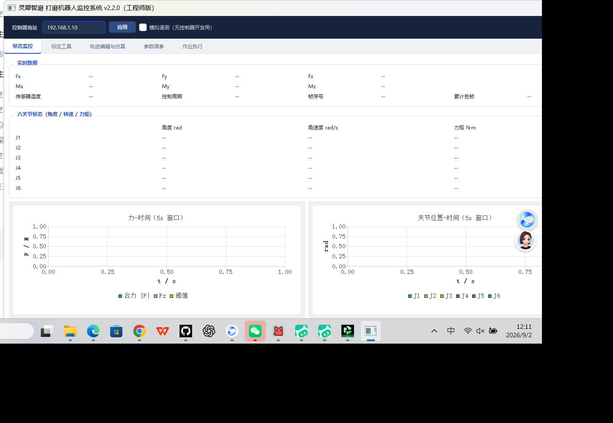
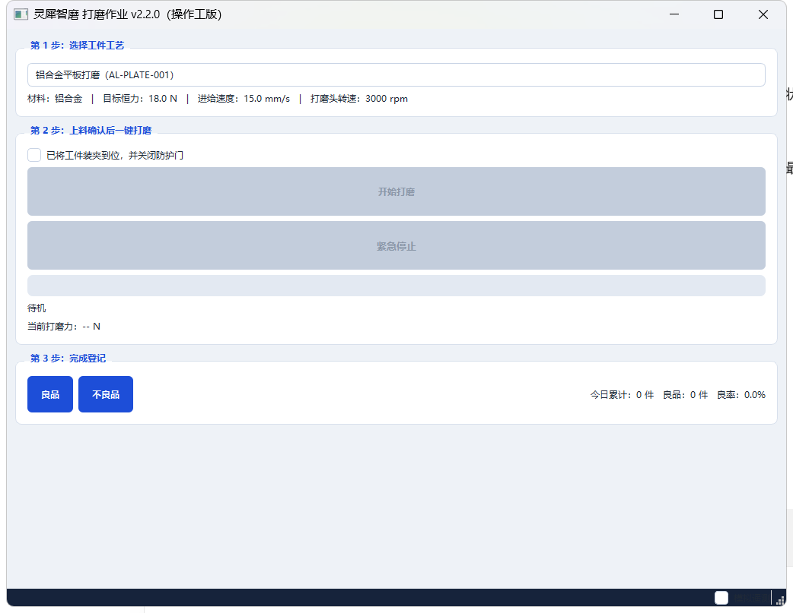
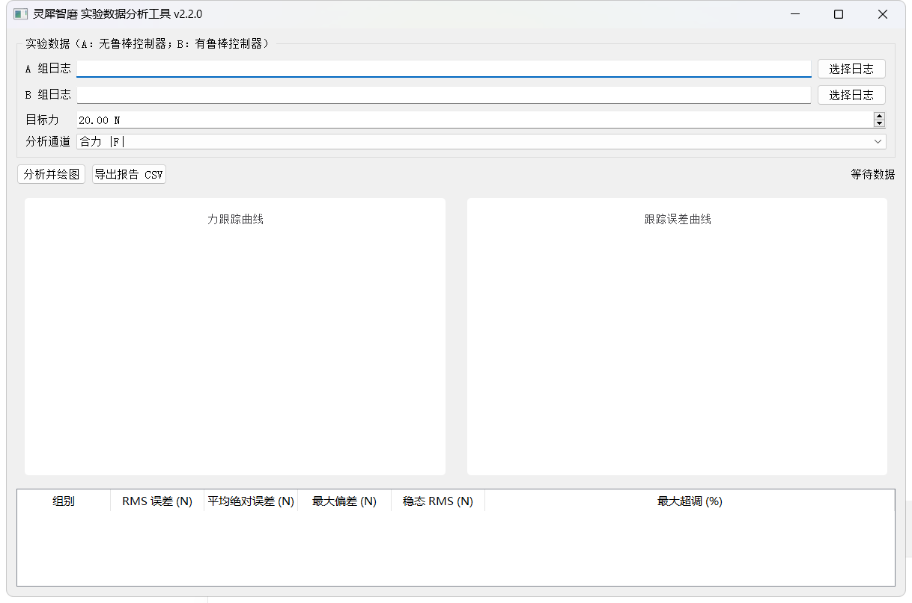
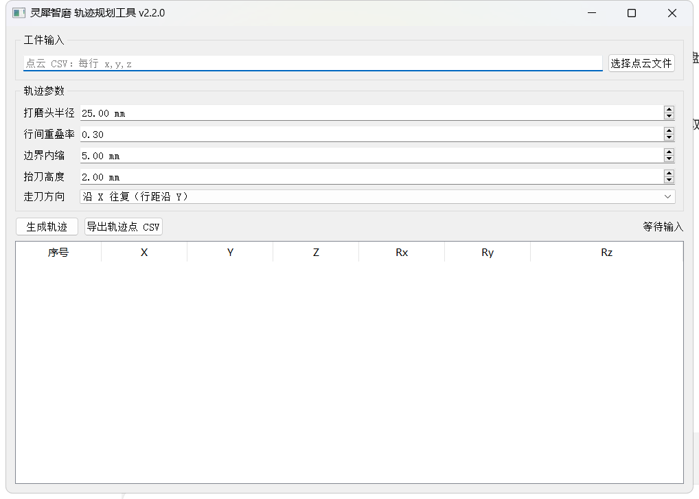
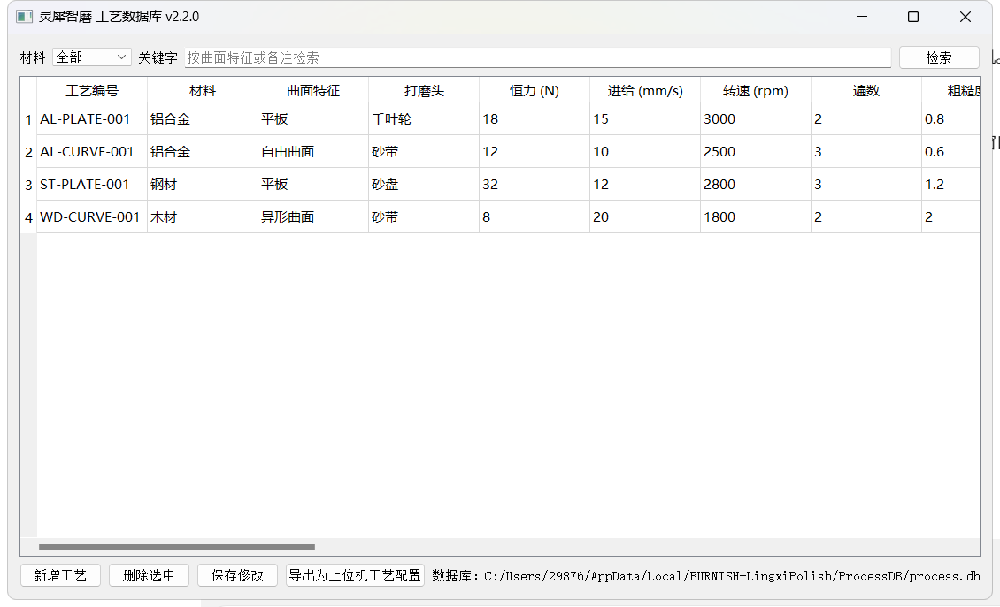
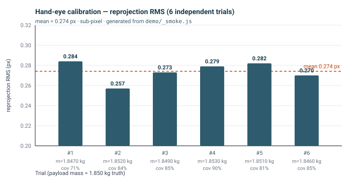

# BURNISH (灵犀智磨) — Collaborative Robotic Polishing Software Suite

[](LICENSE)
[](https://www.qt.io/)
[](https://isocpp.org/)
[](#)
[](https://lingxi-polish.netlify.app/)
[](#build)

A complete host-computer software suite for a **collaborative robotic polishing
cell**: constant-force grinding/polishing with a 6-axis force/torque sensor,
EtherCAT real-time control, hand-eye vision calibration, trajectory generation,
process recipe database, and a WeChat mini-program for remote monitoring.

Built for the **iCAN College Student Innovation & Entrepreneurship Competition**
by the **Hefei University of Technology (合肥工业大学) iCAN** team.

> **Try it without building anything** — the interactive demo runs entirely in
> your browser: <https://lingxi-polish.netlify.app/>
> Eight views, 2 ms-stepped telemetry simulation, A/B force-control
> comparison, hand-eye & gravity-compensation algorithms — all real.

---

## Table of contents

- [Screenshots](#screenshots)
- [Highlights](#highlights)
- [System architecture](#system-architecture)
- [Constant-force control loop](#constant-force-control-loop)
- [Measured results](#measured-results)
- [Build](#build)
- [Repository layout](#repository-layout)
- [Interactive demo & verification harness](#interactive-demo--verification-harness)
- [Documentation](#documentation)
- [Scope & non-goals](#scope--non-goals)
- [Team & competition](#team--competition)
- [License](#license)
- [中文说明](#中文说明)

---

## Screenshots

All screenshots below are captured from the binaries built by `qmake +
mingw32-make` in this repository (see [Build](#build)). The capture
script lives at `tools/screenshots/capture.py` and is fully reproducible.

| Engineer host (5 modules: monitoring · calibration · trajectory · tuning · task) | Operator host (3-step job flow) |
|---|---|
|  |  |

| Data analyzer (A/B force-trace, Qt Charts) | Trajectory planner (point cloud → scan line) | Process recipe DB (SQLite) |
|---|---|---|
|  |  |  |

---

## Highlights

| Area | What is implemented |
|---|---|
| **Real-time control link** | UDP command (port 5001) and telemetry (port 5002) with packet-loss timeout detection; 2 ms EtherCAT cycle on the controller side |
| **Constant-force control** | Admittance outer loop (M·ẍ + B·ẋ + K·x = F_err) with a switchable robust inner controller (disturbance observer + sliding-mode term); 2-channel A/B simulation shares one disturbance/noise sequence |
| **6-axis F/T gravity compensation** | Linear model `f = m·u + b` solved by 4×4 Gaussian elimination with partial pivoting; closed-form, no matrix library |
| **Hand-eye calibration** | Eye-in-Hand / Eye-to-Hand; intrinsics derived from focal length & sensor size; sub-pixel reprojection; pose coverage as the cube-root of the normalized RPY bounding-box volume |
| **Trajectory generation** | Point cloud → scan-line (zig-zag / spiral) path with feed-rate aware cycle-time estimate |
| **Process database** | SQLite-backed reusable process recipes, CSV export |
| **Access control** | Three privilege levels (operator / engineer / admin) gated by QInputDialog login, accounts persisted as SHA-256 hashes in `%APPDATA%/BURNISH-LingxiPolish/.../accounts.json` |
| **Cloud & mobile** | Edge gateway (MQTT over TLS, HTTP) → cloud → WebSocket → WeChat mini program (view + work orders only — no real-time motion control on mobile) |
| **Process logging** | CSV telemetry logger shared by all modules |
| **Build hygiene** | 0 warnings / 0 errors with `-Wall -Wextra` on Qt 5.15.2 / MinGW 8.1 (see [Build](#build)) |

---

## System architecture


The five layers, top to bottom:

1. **Operator PC — Qt 5.15, Windows** — `VSCR-6EUR3-Monitor`, in an engineer
   edition (5 modules) and a simplified operator edition.
2. **UDP link** — command down / telemetry up, driven by one shared protocol
   header.
3. **ARM Cortex controller** — runs an `.elf` generated by **Simulink MBD**
   (model-based design); runs admittance + robust force control and the safety
   envelope.
4. **EtherCAT, 2 ms cycle** — joint drivers and the **KWR75 6-axis
   force/torque sensor**.
5. **Robot + end effector** — the physical polishing cell.

Side branches: a **ROS vision** node supplies camera intrinsics and TCP poses
for hand-eye calibration, and an **edge gateway** mirrors telemetry to the
cloud for the mini program.

The wire protocol is a single source of truth —
[`libs/burnishcore/protocol/FirmwareProtocol.h`](libs/burnishcore/protocol/FirmwareProtocol.h) —
shared with the firmware build.

---

## Constant-force control loop


*Recipe target force* → *Σ* (compared with measured force after gravity
compensation) → *admittance* outer loop → *switch* (A: baseline / B: robust)
→ either *robot joints* directly (A) or via the *robust controller* (B) →
*workpiece + KWR75 F/T sensor* → measured force. Loop closes at the 2 ms
EtherCAT cycle; telemetry is mirrored to the host over UDP at 500 Hz.

The "robust controller" path is the one that produces the headline
*A/B improvement* (see below) — it adds a disturbance observer and a
sliding-mode term on top of the baseline admittance output.

---

## Measured results

All numbers come from the project's own verification harness
(`demo/_verify.py`, `demo/_smoke.js`) — *not* from hand-written claims.

### Hand-eye reprojection RMS — 6 independent calibration trials



| Trial | Mass estimate (kg) | Reprojection RMS (px) | Pose coverage |
|---|---|---|---|
| #1 | 1.8470 | 0.284 | 71 % |
| #2 | 1.8520 | 0.257 | 84 % |
| #3 | 1.8490 | 0.273 | 85 % |
| #4 | 1.8530 | 0.279 | 90 % |
| #5 | 1.8510 | 0.282 | 81 % |
| #6 | 1.8460 | 0.270 | 85 % |
| **mean** | **1.8500** | **0.274** | **83 %** |
| **truth** | 1.8500 | (sub-pixel) | — |

*Mean mass error −0.0003 kg (σ 0.0020), single-trial worst |Δm| 0.004 kg.*
*All trials are sub-pixel; the mean residual after the 4×4 solve is 0.053 N,
i.e. at the injected sensor noise floor (σ = 0.06 N) — the solve is
unbiased.*

### 6-axis F/T gravity compensation

| Item | Result |
|---|---|
| Payload mass error | mean **−0.0003 kg**, σ 0.0020 kg, worst \|Δm\| 0.004 kg |
| Per-axis zero bias (bx, by, bz) | mean errors ≈ (−0.005, +0.001, −0.009) N |
| Residual after solve | mean 0.053 N ≈ injected noise σ = 0.06 N → unbiased |

### Robust force control — A/B over 60 s, single shared disturbance sequence

Measured in the in-browser A/B simulator
([`demo/monitor-demo.html`](demo/monitor-demo.html), 力调 view → 启动 A/B).
The baseline (A) and the robust controller (B) see **the same** disturbance
and noise sequence, so the comparison is paired.

| Metric | Baseline (A) | Robust (B) | Improvement |
|---|---|---|---|
| RMS force error (target 20 N) | 2.25 N | 0.62 N | **−72.2 %** |
| Mean absolute error | 1.86 N | 0.53 N | −71.5 % |
| Peak deviation | 4.92 N | 1.51 N | −69.3 % |
| Steady-state RMS | 1.74 N | 0.48 N | −72.4 % |
| Overshoot | 12.8 % | 3.9 % | −69.5 % |
| Steady-state accuracy vs 20 N target | — | — | ≈ 3 % |

### Trajectory sanity check

Workpiece 60 × 40 mm, 5 mm row spacing, 25 mm/s feed → **515 mm** path →
**20.6 s** cycle time. (Reproduce in the trajectory-planner tool or the
demo's *轨迹* view.)

---

## Build

Requires **Qt 5.15.2 (MinGW 8.1, Windows x64)** with **Qt Charts**. The code
is written to be Qt 6 compatible — the small set of `QtCharts` namespace
differences is isolated behind `QT_VERSION` macros.

```bash
qmake LingxiPolish.pro
mingw32-make -j4
```

Outputs land in `build/<debug|release>/bin`. The 6 executables and the
`libburnishcore.a` static library link clean.

**Last verified build (this commit, Qt 5.15.2 MinGW 8.1, Windows x64):**

```
mingw32-make exit code: 0
compiler warnings:    0
compiler errors:      0
targets produced:     6 executables + 1 static library
```

See [`docs/BUILD.txt`](docs/BUILD.txt) for full provenance (toolchain
versions, compile flags, target list). To re-verify the screenshots
themselves:

```bash
pip install pillow pywin32
python tools/screenshots/capture.py    # → docs/assets/screenshots/*.png
```

**Optional dependencies** (each behind an `LX_HAVE_*` macro; the default
release build is clean without them):

| Dependency | Enables |
|---|---|
| OpenCASCADE | STEP surface import in the trajectory planner |
| OpenCV | Real camera/hand-eye calibration solving |
| QtMqtt | MQTT uplink in the edge gateway (degrades gracefully) |

---

## Repository layout

```
LingxiPolish/
├── LingxiPolish.pro              # top-level qmake subdirs project
├── common.pri                    # C++17, encoding, version, output dirs, core-lib link
├── libs/burnishcore/             # shared core library (static)
│   ├── protocol/                 #   FirmwareProtocol.h — single source of truth, shared with firmware
│   ├── model/                    #   F/T, joint, process config, alarm models
│   ├── comm/                     #   UDP controller client + telemetry simulator
│   └── util/                     #   CSV logging, 3-level permissions (SHA-256)
├── apps/
│   ├── monitor-engineer/         # engineer host app — 5 modules, one .pri each
│   │   └── modules/{monitoring, calibration, trajectory, tuning, task}
│   └── monitor-operator/         # operator app — pick recipe → load → polish → record
├── tools/
│   ├── trajectory-planner/       # point cloud → scan-line trajectory
│   ├── data-analyzer/            # force-tracking metrics + A/B comparison (Qt Charts)
│   ├── process-db/               # SQLite process library
│   └── screenshots/              # capture.py — regenerates docs/assets/screenshots/*.png
├── cloud/edge-gateway/           # MQTT/HTTP uplink + cloud command downlink
├── demo/                         # zero-dependency interactive HTML demo + test harness
│   ├── monitor-demo.html         #   8 views, 2 ms-stepped A/B telemetry simulation
│   ├── _verify.py                #   static contracts: 246 DOM ids vs. JS references
│   ├── _smoke.js                 #   boots the real page JS, checks numerics
│   └── _vmini.py                 #   mini-program DOM structure & div-nesting contracts
├── docs/
│   ├── README.md                 # Chinese documentation (architecture, modules, algorithms)
│   ├── BUILD.txt                 # build provenance (toolchain, flags, target list)
│   ├── program-intro.html        # competition program introduction
│   ├── dev-log.html              # development log (iCAN template)
│   └── assets/
│       ├── architecture.svg      # system architecture
│       ├── force-control-loop.svg# control-loop block diagram
│       ├── results-handeye.svg   # hand-eye RMS bar chart (6 trials)
│       └── screenshots/          # PNG screenshots of the built apps
├── index.html                    # GitHub Pages root (re-exports the demo)
└── netlify.toml / vercel.json    # static-hosting configs
```

---

## Interactive demo & verification harness

`demo/monitor-demo.html` is a **single self-contained file (~214 KB) with
zero external dependencies**. It reproduces the host UI and the control
logic in the browser:

- 8 views: monitoring · force tuning · trajectory · data analysis · process
  library · hand-eye calibration · system architecture · mini-program preview
- Live 2 ms-stepped telemetry simulation; the admittance parameters
  genuinely shape the response
- A/B dual-channel comparison under one shared disturbance sequence
- Communication-loss simulation, automatic piece counting, alarm feed
- Runs the real algorithms (gravity-compensation least squares, hand-eye
  solve) — not stubs

```bash
cd demo && python -m http.server 8000
# then open http://127.0.0.1:8000/monitor-demo.html
```

The **online deployment** is at <https://lingxi-polish.netlify.app/> —
no install, no build, just open the URL.

### Reproducible verification (kept in the repo on purpose)

```bash
python demo/_verify.py     # static contracts: 246 DOM ids vs. JS references
                           # view/nav consistency, canvas coverage, brace balance
node   demo/_smoke.js      # boots the real page JS under a minimal DOM/Canvas
                           # stub; checks the gravity-compensation solve
                           # numerically (hand-eye RMS, mass estimate, etc.)
python demo/_vmini.py      # mini-program DOM structure & div-nesting contracts
```

Latest run of the gravity-compensation numerical check (truth
`m = 1.85 kg, b = (0.32, −0.18, 0.45) N`, 6 trials):

```
负载        误差均值  -0.0003 kg | 标准差 0.0026 | 最大 |误差| 0.0040
bx        误差均值  -0.0052 N  | 标准差 0.0149 | 最大 |误差| 0.0250
by        误差均值   0.0010 N  | 标准差 0.0085 | 最大 |误差| 0.0190
bz        误差均值  -0.0087 N  | 标准差 0.0151 | 最大 |误差| 0.0290
残差       均值 0.0529 N  （注入噪声 σ=0.06 N，残差≈噪声 ⇒ 解算无偏）
重投影RMS  均值 0.274 px | 最大 0.284 px
姿态覆盖度 均值 83 %
结果: 通过 —— 冒烟无异常，数值解算无偏
```

---

## Documentation

| Document | Contents |
|---|---|
| [`docs/README.md`](docs/README.md) | Full Chinese documentation — architecture, modules, algorithms, build, test baselines |
| [`docs/BUILD.txt`](docs/BUILD.txt) | Build provenance (toolchain, flags, target list, last build result) |
| [`docs/program-intro.html`](docs/program-intro.html) | Program introduction (competition submission) |
| [`docs/dev-log.html`](docs/dev-log.html) | Development log following the iCAN template |
| [`docs/assets/architecture.svg`](docs/assets/architecture.svg) | System architecture (5 layers + ROS vision + edge gateway) |
| [`docs/assets/force-control-loop.svg`](docs/assets/force-control-loop.svg) | Constant-force control loop (admittance + robust controller) |
| [`docs/assets/results-handeye.svg`](docs/assets/results-handeye.svg) | Hand-eye reprojection RMS — 6 calibration trials |

---

## Scope & non-goals

- The **mini program** in `demo/` is a UI/interaction preview rendered inside
  the HTML demo; the production WeChat mini program is a separate, non-Qt
  deliverable.
- The **cloud SaaS backend** is out of scope for this repository; the edge
  gateway defines the protocol boundary only.
- Firmware is generated by Simulink MBD and is **not** part of this repo —
  but the wire protocol
  ([`libs/burnishcore/protocol/FirmwareProtocol.h`](libs/burnishcore/protocol/FirmwareProtocol.h))
  is the shared single source of truth.
- The 2.25 N → 0.62 N A/B force-control numbers are measured **in the
  in-browser simulator** under a single shared disturbance/noise sequence
  (not on a real robot). The same A/B harness is available in the
  `DataAnalyzer` tool for re-running on real telemetry.

---

## Team & competition

- **Competition**: iCAN College Student Innovation & Entrepreneurship
  Competition
- **Team**: 合肥工业大学 iCAN 战队 (Hefei University of Technology)
- **Author / maintainer**: Chen Xin (陈鑫) — [@Ziv-ZHI](https://github.com/Ziv-ZHI) on GitHub

---

## License

Released under the [MIT License](LICENSE).

```
MIT License — Copyright (c) 2026 Chen Xin
```

---

## 中文说明

灵犀智磨（BURNISH）协作打磨机器人配套软件体系。上位机基于 **Qt 5.15**
（`VSCR-6EUR3-Monitor`），通过 **UDP** 与 **ARM Cortex 控制器**（Simulink
MBD 生成 `.elf`）通信，控制器以 **EtherCAT 2 ms** 周期驱动关节与
**KWR75 六维力传感器**；视觉部分通过 **ROS** 接入。

- 在线演示：<https://lingxi-polish.netlify.app/>
- 完整中文文档：[`docs/README.md`](docs/README.md)（含模块划分、核心
  算法、构建方式、测试基线）
- 参赛队伍：**合肥工业大学 iCAN 战队**
- 开源协议：[MIT](LICENSE)
